# Flow Diagrams

Visual diagrams to help understand the system architecture and flows.

> **Note:** These diagrams use [Mermaid](https://mermaid.js.org/) syntax. They render automatically on GitHub and in many Markdown viewers.

---

## System Architecture

High-level view of how components connect:

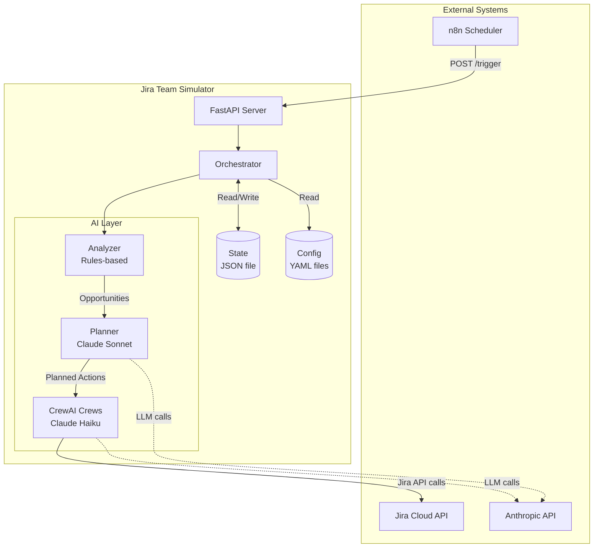

---

## Tick Execution Flow

What happens when `/trigger` is called:

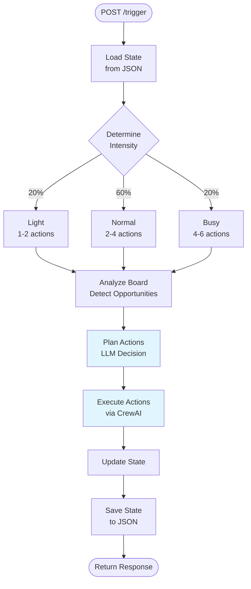

---

## Scenario State Machine

How tickets flow through different scenario types:

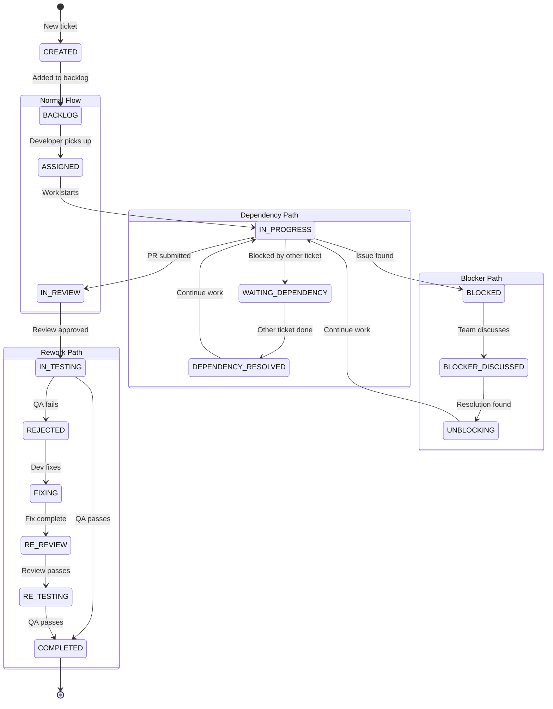

---

## Agent Decision Flow

How an agent decides what action to take:

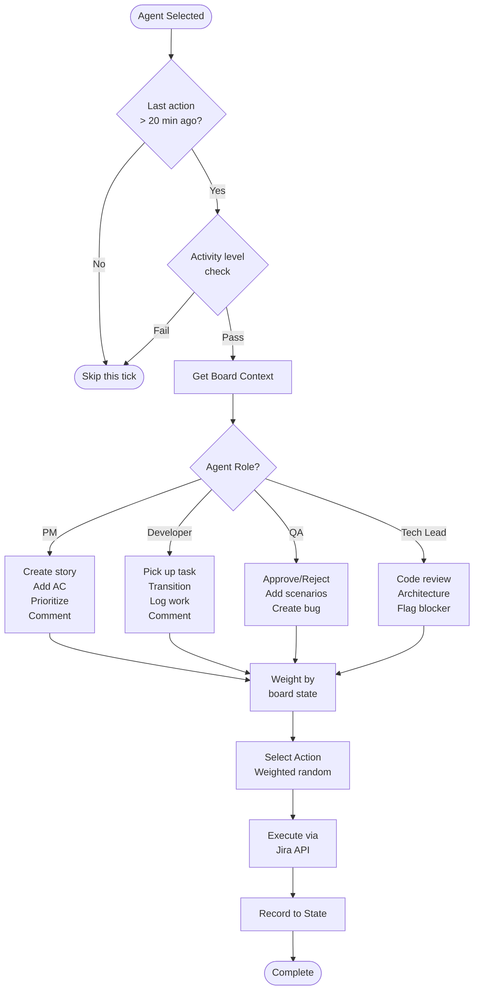

---

## Jira Workflow Mapping

How simulator states map to Jira workflow:

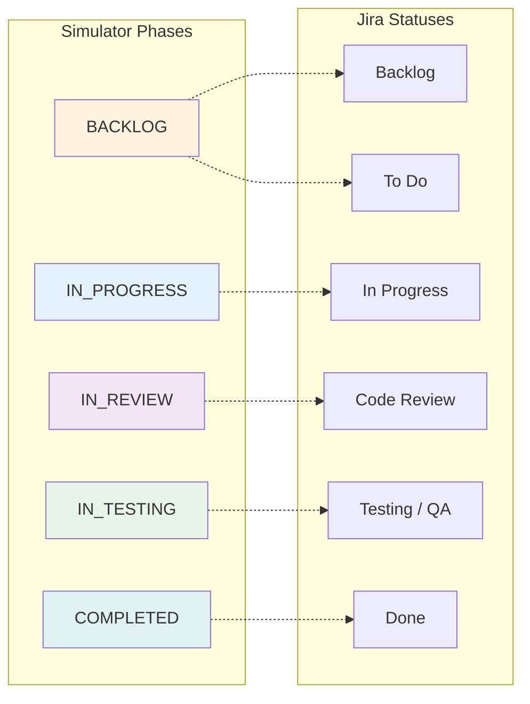

---

## AI Planning Flow

How the planner decides actions:

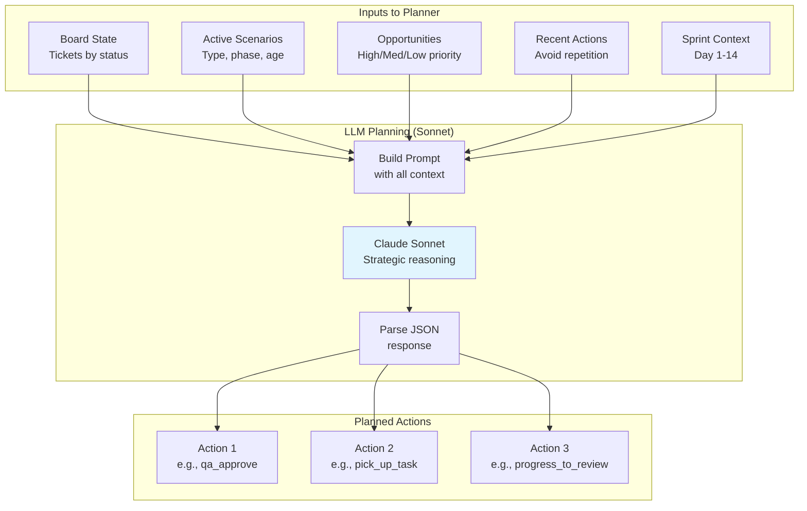

---

## Comment Generation Flow

How AI generates contextual comments:

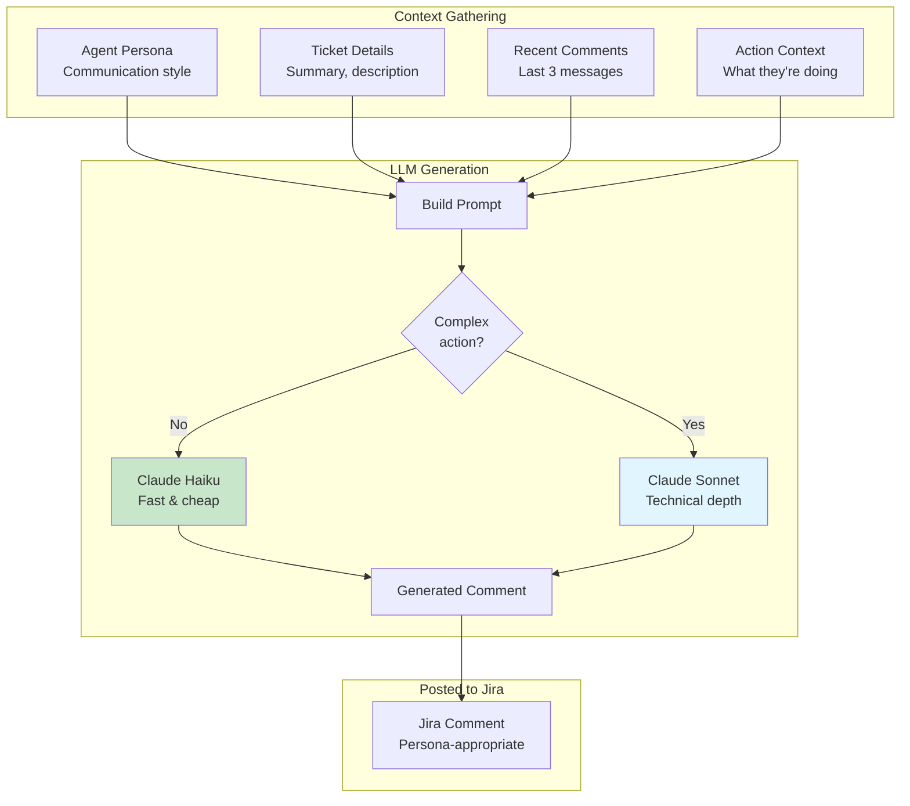

---

## Sprint Lifecycle

How activity varies through a sprint:

```mermaid
gantt
    title Sprint Activity Patterns
    dateFormat X
    axisFormat Day %s

    section Task Pickup
    High pickup rate    :active, 1, 3
    Moderate pickup     :        4, 7
    Low pickup         :        8, 14

    section Development
    Ramping up         :        1, 3
    Peak development   :active, 4, 10
    Finishing up       :        11, 14

    section Code Review
    Low activity       :        1, 4
    Peak reviews       :active, 5, 11
    Final reviews      :        12, 14

    section QA/Testing
    Minimal testing    :        1, 7
    Peak testing       :active, 8, 13
    Final verification :        14, 14

    section Blockers
    May emerge         :crit,   4, 10

    section Scope Creep
    Possible window    :crit,   4, 10
```

---

## Team Interaction Pattern

How teams and roles interact:

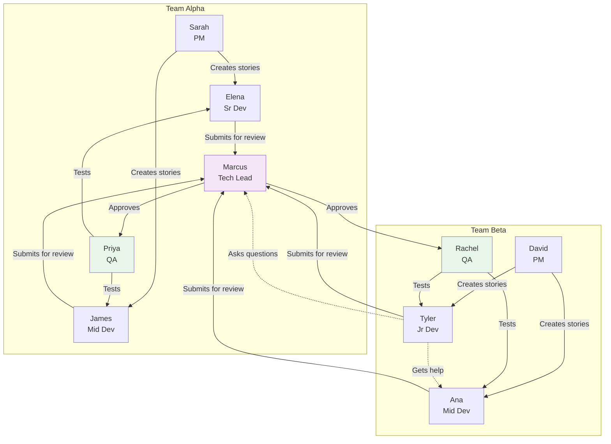

---

## Data Flow

How data moves through the system:

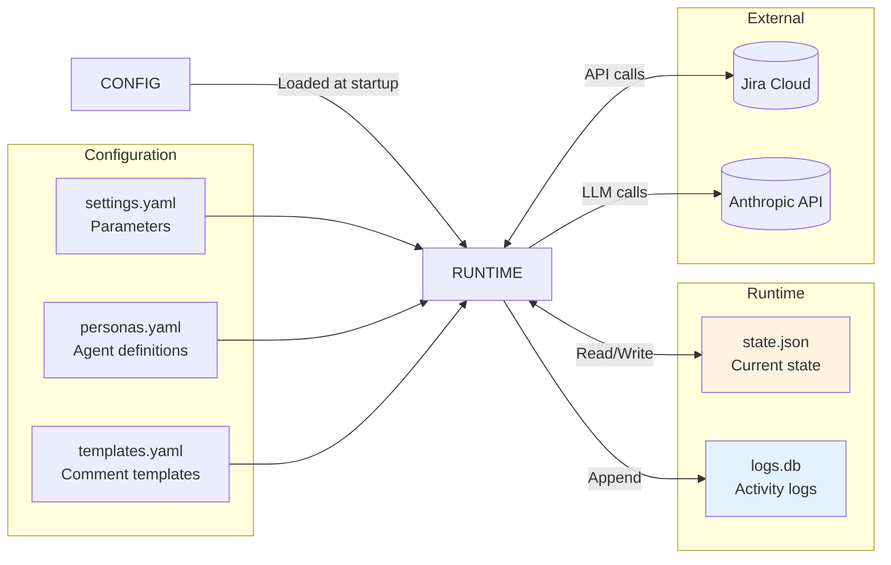

---

## Error Handling Flow

How the system handles failures:

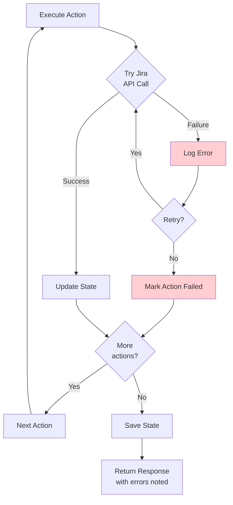
